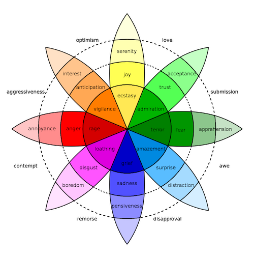

# ItEM - Italian EMotive lexicon

ItEM is a a high-coverage emotion lexicon for Italian in which each target term is provided with an association score with the basic emotions defined the in Plutchik (1994)’s taxonomy: **JOY, SADNESS, ANGER, FEAR, TRUST, DISGUST, SURPRISE, ANTICIPATION**.



## Contents of this repository
 
 - the list of seed words collected in Passaro et al., 2015. The seeds are provided both as [lemmas](seeds/ItEM.elicitated.lemmas.txt) and [tokens](seeds/ItEM.elicitated.tokens.txt)
 
 - the [pre-compiled emotive lexicon](pre-compiled-lexica/ItEM.SintParModel.cos) described in Passaro and Lenci (2016) and referred as _SintParModel_ 
 
 
 - the [pre-compiled emotive lexicon](pre-compiled-lexica/ItEM.FBNEWS15.cos) built by exploiting count vectors extracted from FB-NEWS15 (Passaro et al., 2016); 
 
 - a [simplified implementation](ItEM.ipynb) of ItEM that can be used to create new lexica from a list of seeds and a list of word embeddings.

## Requirements and Usage

The code in this repository is compatible with Python3.x and depends on these libraries:

- Numpy
- Scipy
- Scikit-learn
- Gensim
- Pandas

We recommend to use a virtual environment and to install the specific versions of  each library provided in the [requirements file](requirements.txt)

Usage is described in the jupyter notebook [ItEM](ItEM.ipynb)


## Citation 


```
@inproceedings{DBLP:conf/lrec/PassaroL16,
  author    = {Lucia C. Passaro and
               Alessandro Lenci},
  editor    = {Nicoletta Calzolari and
               Khalid Choukri and
               Thierry Declerck and
               Sara Goggi and
               Marko Grobelnik and
               Bente Maegaard and
               Joseph Mariani and
               H{\'{e}}l{\`{e}}ne Mazo and
               Asunci{\'{o}}n Moreno and
               Jan Odijk and
               Stelios Piperidis},
  title     = {Evaluating Context Selection Strategies to Build Emotive Vector Space
               Models},
  booktitle = {Proceedings of the Tenth International Conference on Language Resources
               and Evaluation {LREC} 2016, Portoro{\v{z}}, Slovenia, May 23-28, 2016},
  publisher = {European Language Resources Association {(ELRA)}},
  year      = {2016},
  url       = {http://www.lrec-conf.org/proceedings/lrec2016/summaries/637.html},
  timestamp = {Mon, 19 Aug 2019 15:22:52 +0200},
  biburl    = {https://dblp.org/rec/conf/lrec/PassaroL16.bib},
  bibsource = {dblp computer science bibliography, https://dblp.org}
}
```


# References

[Passaro et al., (2015): ItEM: A Vector Space Model to Bootstrap an Italian Emotive Lexicon](https://arpi.unipi.it/retrieve/handle/11568/766226/80602/clic-2015-2.pdf)
  
[Passaro, Lenci (2016): Evaluating Context Selection Strategies to Build Emotive Vector Space Models](http://colinglab.humnet.unipi.it/wp-content/uploads/2012/12/Passaro_Lenci_LREC2016.pdf)

[Passaro et al., (2016): FB-NEWS15: A Topic-Annotated Facebook Corpus for Emotion Detection and Sentiment Analysis](http://colinglab.humnet.unipi.it/wp-content/uploads/2012/12/passaro_etal_CLIC2016.pdf)